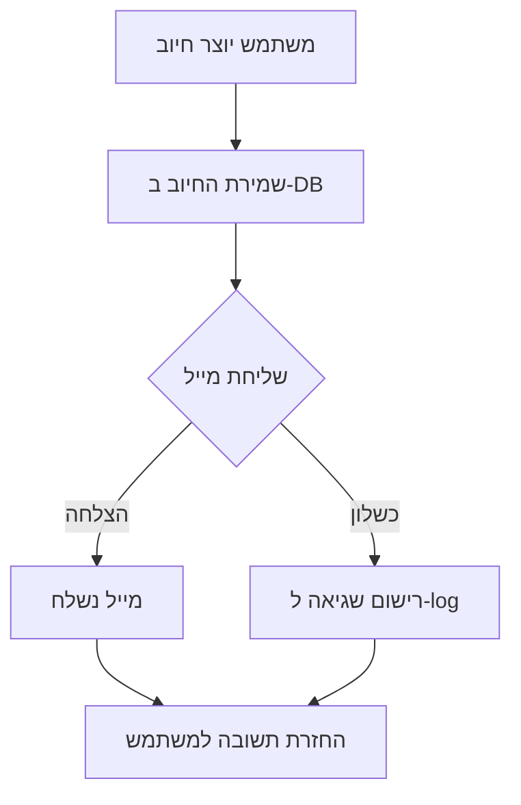

# התראות מייל על חיובים חדשים

## תיאור

פיצ'ר זה שולח מייל אוטומטי בכל פעם שנוצר חיוב חדש במערכת. המייל נשלח לכתובת קבועה (`nerya@vatkin.co.il`) ומכיל את פרטי החיוב והלקוח.

## איך זה עובד



## נקודות שילוב

המייל נשלח משני מקומות ביצירת חיוב:

1. **`app.py`** - פונקציית `update_finance` (action=extra)
2. **`backend/blueprints/finance.py`** - פונקציית `quick_add_charge`

## פרטי המייל

המייל כולל:
- שם הלקוח
- תיאור החיוב
- סכום החיוב
- עלות שלנו
- תאריך החיוב
- מספר חיוב

## הגדרות נדרשות

יש להגדיר את משתני הסביבה הבאים בקובץ `.env`:

```env
SMTP_SERVER=smtp.gmail.com
SMTP_PORT=587
SMTP_USERNAME=your-email@gmail.com
SMTP_PASSWORD=your-app-password
```

### הערות לגבי Gmail

אם משתמשים ב-Gmail, יש ליצור "App Password":
1. היכנסו ל-Google Account Settings
2. Security > 2-Step Verification (חייב להיות מופעל)
3. App passwords > Generate new app password
4. השתמשו בסיסמה שנוצרה ב-`SMTP_PASSWORD`

## קבצים רלוונטיים

- `backend/utils/email.py` - פונקציית `send_charge_notification_email`
- `app.py` - שילוב ב-`update_finance`
- `backend/blueprints/finance.py` - שילוב ב-`quick_add_charge`

## טיפול בשגיאות

שליחת המייל עטופה ב-try/except כדי שכשל בשליחה לא ימנע את יצירת החיוב. שגיאות נרשמות ל-log עם הודעת WARNING.

## שינוי כתובת הנמען

כרגע הכתובת קבועה בקוד (`nerya@vatkin.co.il`). לשינוי הכתובת, יש לערוך את הקובץ `backend/utils/email.py` בפונקציה `send_charge_notification_email`.
